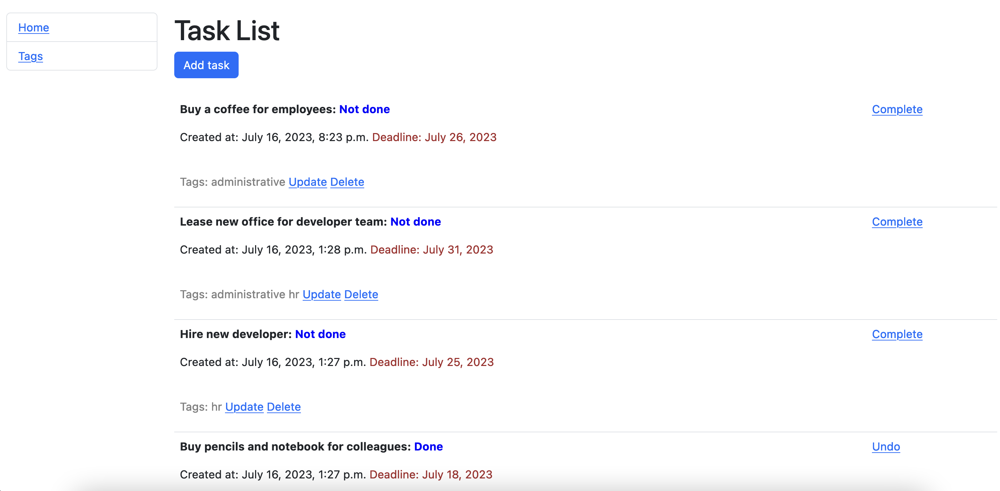

# Task Manager

## Overview
The Task Manager ("Project") allows you to track Tasks with Tags assigned to them. 

## Installing / Getting started
```shell
git clone https://github.com/andriy-md/todo-list.git
cd todolist
python3 -m venv venv
source venv/bin/activate
pip install -r requirements.txt
python manage.py runserver      # Starts Django Server
```

## Features
* You can watch list of all Tasks with assigned Tags.
* You may create new Task as well as update information concerning the existing one or delete it.


## Demo

